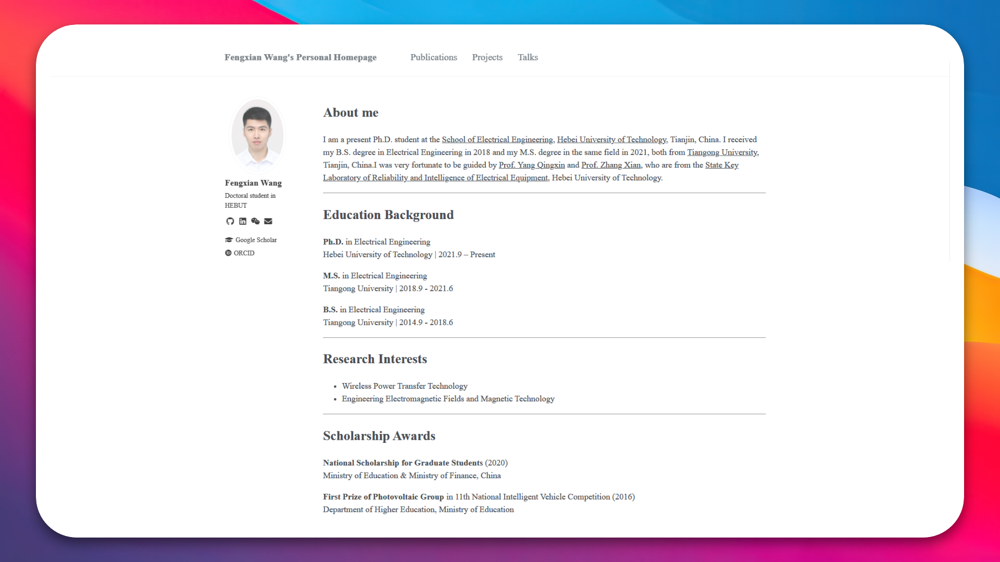
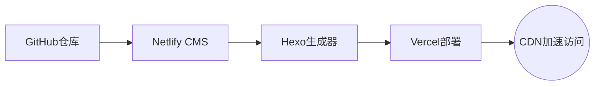

# 🚀 ScholarPress · Academic Portfolio Builder 

[](https://github.com/Fengxian-wang/academia-hexo-netlify-cms-vercel/blob/main/LICENSE)
[](https://vercel.com/new/clone)
[](https://github.com/Fengxian-wang/hexo-netlify-cms-vercel/generate)

> Hexo × Netlify CMS × Vercel 驱动的零代码学术门户解决方案

---

## 🌟 核心特性

<div align="center">
  
  <p style="margin-top: 12px; color: #666; font-size: 0.9em;">▲ 学术主页演示 - 包含个人信息展示、所获奖励、学术履历等核心模块</p>
</div>

### 🎯 学术专属功能
- **论文展示系统** - Netlify CMS在线后台编辑（无代码）
- **科研时间轴** - 可视化呈现项目里程碑与学术轨迹
- **学术身份集成** - 链接ORCID/Google Scholar/ResearchGate
- **LaTeX支持** - 原生渲染数学公式与专业符号

### ⚡ 技术架构优势


---

## 🔧 部署指南

### 第一步：Fork项目模板
[](https://github.com/Fengxian-wang/hexo-netlify-cms-vercel/generate)

```text
创建时可以设为私有仓库（建议公开以方便后续维护）
```

### 第二步：部署到 Vercel
[](https://vercel.com/new/clone)

```bash
点击部署，等待完成（约2-5分钟）
获得临时访问地址 "https://your-vercel-domain.vercel.app"
```

### 第三步：域名配置（可选）
1. 部署完成后，在Vercel控制台：
   - 前往项目设置 > Domains
   - 可绑定自定义域名（需验证DNS）
   - SSL证书会自动生成

---

## ⚙ 核心配置

### 第四步：配置 Netlify-CMS
```yaml
修改 /source/admin/config.yml
backend:
  repo: your-github-username/your-repo-name         # 替换为你的仓库路径
  base_url: https://your-vercel-domain.vercel.app   # 临时访问地址 或者 绑定的自定义域名
```

### 第五步：创建 GitHub OAuth 应用
1. 访问 https://github.com/settings/developers
2. 点击 "New OAuth App"
3. 填写：
   - Application name: 任意名称（如 MyBlogCMS）
   - Homepage URL: https://your-vercel-domain.vercel.app                             # 临时访问地址 或者 绑定的自定义域名
   - Authorization callback URL: https://your-vercel-domain.vercel.app/callback      # 暂时用临时域名，部署后可以修改

---

## 🔑 授权设置

### 第六步：获取客户端凭证
```diff
• Client ID: xxxxxxxx

• Client Secret: gho_xxxxxxxxxxxxxxxxx

```

### 第七步：更新Vercel变量
```env
OAUTH_GITHUB_CLIENT_ID = your_client_id
OAUTH_GITHUB_CLIENT_SECRET = your_client_secret
```

```bash
重新部署，等待完成（约2-5分钟）
```

---

## 🧪 功能验证

### 第八步：测试 CMS 系统
1. 访问 `https://your-domain/admin/`                      # 临时访问地址/admin/ 或者 绑定的自定义域名/admin/
2. 使用GitHub账号登录
3. 测试功能：
   - 创建新文章
   - 修改配置
   - 查看提交记录是否同步到GitHub仓库

---

## 🌈 高级功能

<details>
<summary><b>Netlify 预览功能（点击展开）</b></summary>

```markdown
1. 登录 https://app.netlify.com
2. 新建站点并关联同一个GitHub仓库
3. 无需额外配置，保持默认即可
4. 在Netlify-CMS编辑时即可使用预览功能
```
</details>

---

## 🚨 常见问题

| 问题现象       | 解决方案                      |
|----------------|-----------------------------|
| 403错误        | 检查OAuth回调URL的HTTPS协议    |
| 内容不同步     | 验证config.yml的仓库路径      |
| 样式丢失       | 清除浏览器缓存                |
| 预览失败       | 检查Netlify构建状态          |

---

## 🔄 后续维护

1. 所有变更通过Git提交保存  
2. 直接编辑`/source/_posts`内容文件  
3. 通过Git同步原仓库主题更新  

> 💡 建议首次部署后创建测试文章验证流程，遇到授权问题可重新生成Client Secret。  
> 💡 `/source/admin/config.yml`中`base_url`、OAuth应用配置中`callback URL`和`URL`保持一致，其中`callback URL=URL/callback`。  
> 💡 `themes/Academia/_config.yml`修改主页个人信息

---

## 📜 开源协议

本项目基于 [MIT License](LICENSE) 开源，学术机构可免费商用

[](https://github.com/Fengxian-wang/ScholarPress)
